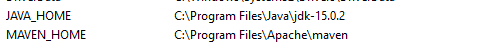
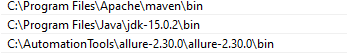

To Run this Test it's necessary 

Use jdk 15 
add both Maven and JAVA enviroment variables

add user variables 

befora that, install maven

run project with
mvn clean test
mvn verify -DskipTests -> to check html report

report will be at.\target\cucumber-report-html\cucumber-html-reports
Use chrome or firefox, check drivers
